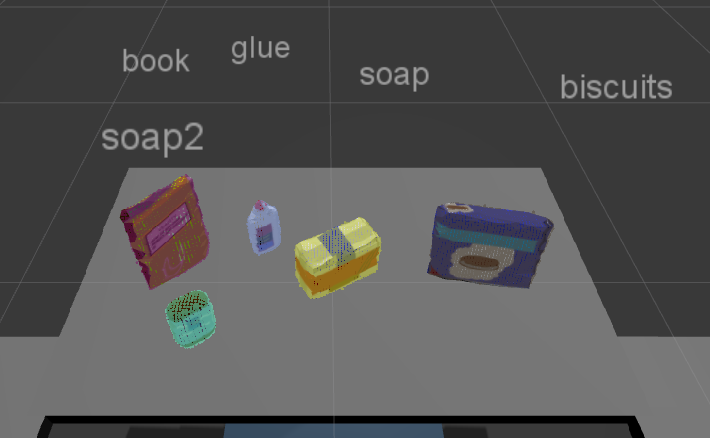

# Perception and Object Recognition with 3D Point-clouds

This repository contains a Robot Operating System (ROS) perception pipeline implementation for identifying and classifying objects from a noisy tabletop environment, using point-cloud data from an RGB-D sensor. This is used for picking, sorting and relocating of the objects into bins using a PR2 robot. This project uses ROS with Python for project 3 of the [](https://www.udacity.com/robotics)

## Writeup

The [writeup.md](writeup.md) contains details of the code, future work and where it currently falls short in the implementation.

## Prerequisites

1. [Ubuntu](https://www.ubuntu.com/) OS, as at the time of this writing, ROS only works on Ubuntu.

2. Python 2. Installation instructions can be found [here](https://www.python.org/downloads/).

3. Robot Operating System (ROS). Installation instructions can be found [here](http://wiki.ros.org/ROS/Installation).

#### External repositories

This project uses two external repositories. One for training the object classification model and a second for implementing the PR2 tabletop environment for pick and place.

###### Training repository

This step can be skipped and is not required if the pre-trained `model.sav` is used. Otherwise, Download and setup the [Udacity Perception Exercises repository](https://github.com/udacity/RoboND-Perception-Exercises). If ROS is installed, follow the setup instructions outlined in the repositories README.

###### Test Enviroment repository

Download and setup the [Udacity Perception Project repository](https://github.com/udacity/RoboND-Perception-Project.git). If ROS is installed, follow the setup instructions outlined in the repositories README.

## Installing

Clone this repository

```sh
$ git clone https://github.com/Heych88/udacity-robond-Perception.git
```

If you wish to train the model and have followed the steps in the *Training repository*, Copy the files in the `/sensor_stick` folder into the `~/catkin_ws/src/sensor_stick` folder.

```sh
$ cd <this cloned repository path>/udacity-robond-Perception
$ cp -R sensor_stick/scripts/* ~/catkin/src/sensor_stick/scripts
$ cp sensor_stick/src/sensor_stick/features.py  ~/catkin/src/sensor_stick/src/sensor_stick
```

If you wish to use the trained model and have followed the steps in the *Test Environment repository*, copy the files `model.sav` and `project_template.py` in the  `~/catkin_ws/src/RoboND-Perception-Project/pr2_robot/scripts` folder.

```sh
$ cd <this cloned repository path>/udacity-robond-Perception
$ cp model.sav project_template.py ~/catkin_ws/src/RoboND-Perception-Project/pr2_robot/scripts
```
Now install missing dependencies using rosdep install:
```sh
$ cd ~/catkin_ws
$ rosdep install --from-paths src --ignore-src --rosdistro=kinetic -y
```
Build the project:
```sh
$ cd ~/catkin_ws
$ catkin_make
```
Add following to your .bashrc file
```
export GAZEBO_MODEL_PATH=~/catkin_ws/src/RoboND-Perception-Project/pr2_robot/models:$GAZEBO_MODEL_PATH
```

If you haven’t already, following line can be added to your .bashrc to auto-source all new terminals
```
source ~/catkin_ws/devel/setup.bash
```

## Run the Code

###### Training

In a terminal window, type the following,
```sh
$ cd ~/catkin_ws
$ roslaunch sensor_stick training.launch
```
You should arrive at a result similar to the below.


In a new terminal, run the capture_features.py script to capture and save features for each of the objects in the environment.
```sh
$ cd ~/catkin_ws
$ rosrun sensor_stick capture_features.py
```
When it finishes running, in the `/catkin_ws` you should have a `training_set.sav` file containing the features and labels for the dataset. Copy this file to the `~/catkin_ws/src/RoboND-Perception-Project/pr2_robot/scripts` folder and rename to  `model.sav`.
```sh
$ cd ~/catkin_ws
$ cp training_set.sav ~/catkin_ws/src/RoboND-Perception-Project/pr2_robot/scripts/model.sav
```

###### Test Enviroment

In a terminal window, type the following,
```sh
$ cd ~/catkin_ws
$ roslaunch pr2_robot pick_place_project.launch
```
You should arrive at a result similar to the below.


Once Gazebo and RViz are up and running, In a new terminal window type,
```sh
$ cd ~/catkin_ws/src/RoboND-Perception-Project/pr2_robot/scripts
$ rosrun pr2_robot project_template.py
```
You should arrive at a result similar to the below.



Proceed through the project by pressing the ‘Next’ button on the RViz window when a prompt appears in your active terminal.

The project ends when the robot has successfully picked and placed all objects into respective dropboxes (though sometimes the robot gets excited and throws objects across the room!)

## Usage

Given a cluttered tabletop scenario, the perception pipeline will identify target objects from a so-called “Pick-List” in a particular order, pick up those objects and place them into their corresponding dropbox.

## Contributing

1. Fork it!
2. Create your feature branch: `git checkout -b my-new-feature`
3. Commit your changes: `git commit -am 'Add some feature'`
4. Push to the branch: `git push origin my-new-feature`
5. Submit a pull request.

## License

This project is licensed under the MIT License - see the [LICENSE.md](LICENSE.md) file for details.
