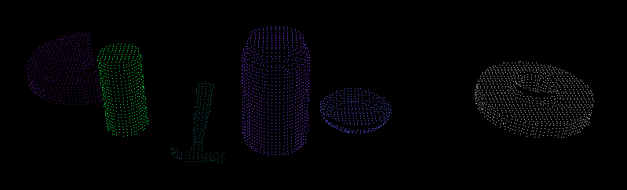
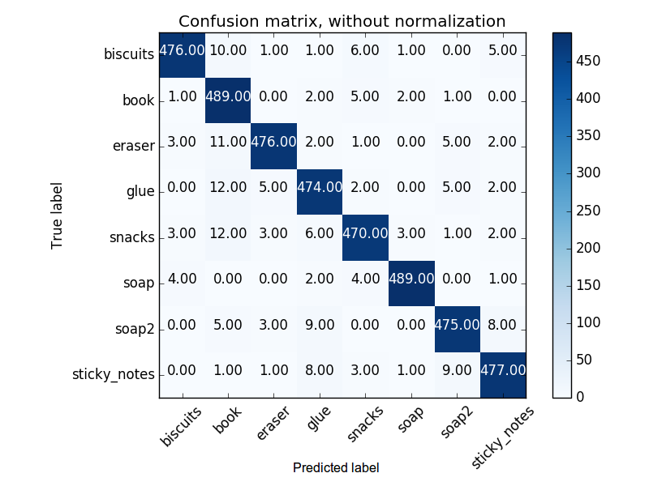
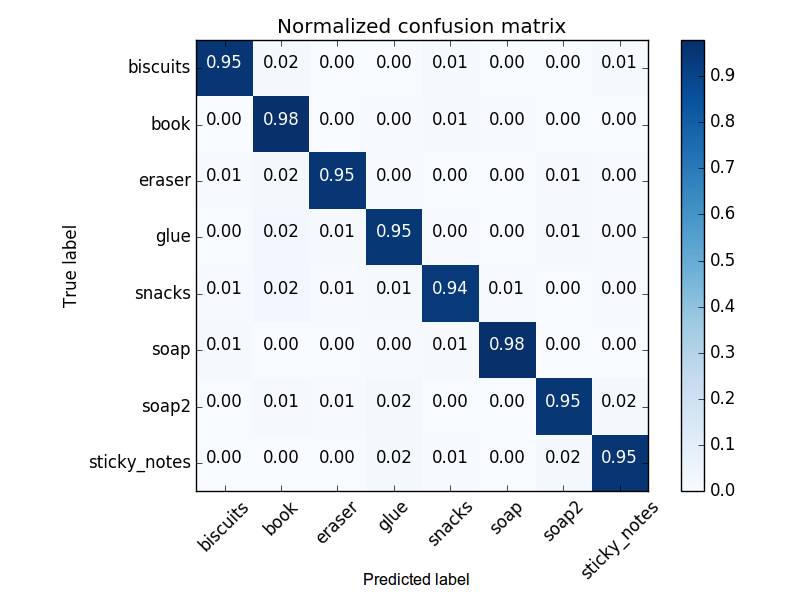

## Project: Perception Pick & Place
### Writeup Template: You can use this file as a template for your writeup if you want to submit it as a markdown file, but feel free to use some other method and submit a pdf if you prefer.

---

# Required Steps for a Passing Submission:
1. Extract features and train an SVM model on new objects (see `pick_list_*.yaml` in `/pr2_robot/config/` for the list of models you'll be trying to identify).
2. Write a ROS node and subscribe to `/pr2/world/points` topic. This topic contains noisy point cloud data that you must work with.
3. Use filtering and RANSAC plane fitting to isolate the objects of interest from the rest of the scene.
4. Apply Euclidean clustering to create separate clusters for individual items.
5. Perform object recognition on these objects and assign them labels (markers in RViz).
6. Calculate the centroid (average in x, y and z) of the set of points belonging to that each object.
7. Create ROS messages containing the details of each object (name, pick_pose, etc.) and write these messages out to `.yaml` files, one for each of the 3 scenarios (`test1-3.world` in `/pr2_robot/worlds/`).  See the example `output.yaml` for details on what the output should look like.  
8. Submit a link to your GitHub repo for the project or the Python code for your perception pipeline and your output `.yaml` files (3 `.yaml` files, one for each test world).  You must have correctly identified 100% of objects from `pick_list_1.yaml` for `test1.world`, 80% of items from `pick_list_2.yaml` for `test2.world` and 75% of items from `pick_list_3.yaml` in `test3.world`.

## [Rubric](https://review.udacity.com/#!/rubrics/1067/view) Points
### Here I will consider the rubric points individually and describe how I addressed each point in my implementation.  

---
### Writeup / README

#### 1. Provide a Writeup / README that includes all the rubric points and how you addressed each one.  You can submit your writeup as markdown or pdf.  

You're reading it!

### Exercise 1, 2 and 3 pipeline implemented

Here I'll talk about the code, what techniques I used, what worked and why, where the implementation might fail and how I might improve it if I were going to pursue this project further.

The code mentioned in the following outline can be found in the `project_template.py` file located ./pr2_robot/scripts/.

The `project_template.py` file takes an RGB-D point-cloud, locates and classifies objects and then sends the pick and place coordinates to the PR2 controller for object sorting into two locations.

#### 1. Complete Exercise 1 steps. Pipeline for filtering and RANSAC plane fitting implemented.

The code from the description below can be found in the `project_template.py` file.

Point-cloud data is collected from the robots RGB-D camera and first filtered to remove data outliers with the use of a nearest-neighbour, standard deviation filter. The function `outlierFilter()`, located between lines 70 and 86 and called with the system parameters on line 217, removes the RGB-D noise from the point cloud. Below is an example of outlier removal, copied from the Udacity *Outlier Removal Filter* section 16 of the *Lesson 3: Calibration, Filtering, and Segmentation* lessons.

After downsampling the data with the function `voxelGrid()`, located between lines 88 and 98 and called with the system parameters on line 219, the data is then cropped to the known locations of where the objects in the field of view will be located. This is achieved with a pass-through filter in the x, y and z planes, forward looking of the camera, left and right of the camera and bottom to the top of the camera respectively. The function `passThroughFilter()`, located on lines 100 to 117 and called with the system parameters on lines 223, 225 and 227, removes the data from outside the supplied min and max values. Below is an example of the output of the *voxelGrid* data and the *passThroughFilter* point clouds.

Following this, segmentation is performed using the RANSAC algorithm using the function `ransacFilter()`, located from line 119 to 136 and called with the system parameters on lines 230 will split the data into two segments, inliers, tabletop, and outliers, objects in the image. Below are examples of the inlier and outlier point clouds.

#### 2. Complete Exercise 2 steps: Pipeline including clustering for segmentation implemented.  

Once the above objects have been filtered from the point-cloud, Euclidean clustering can be performed to locate and segment each cluster for classification. The function `euclideanCluster()`, located on between lines 138 and 158 and called with the system parameters on lines 238. Below is an example of the clustered outliers point cloud.

#### 2. Complete Exercise 3 Steps.  Features extracted and SVM trained.  Object recognition implemented.

After the clusters have been located, features from each cluster can be extracted and then compared with a trained State Vector Machine (SVM) to classify the object most likely associated with each cluster. The function `classifyClusters()`, located from line 160 to 203 and called with the system parameters on lines 266, performs this object classification.

Feature extraction was performed using binned histograms of each feature. This method provides the benefit or removing object detail, as the bin size decreases, which normalises the object features, allowing better classification no matter its orientation or position. However, as the bin size decreases, detail is lost, and different objects begin to show the same characteristic's resulting in incorrect object classification.

A model has been trained with each objects potential features, which consist of the binned histograms of all the image channels in the *HSV* colour spaced and the surface normals in the x, y and z planes of the clustered point-cloud. These feature extraction's can be found in the function `classifyClusters()`, at lines 180 for colour and 183 for object surface normals.

During training of the model, it has been found that using the *HSV* resulted in more consistent correct classification over the standard *RGB* colour space. The number of bins was found to be consistent within the range of 24 to 64, with some objects having better classification with a low bin count and other objects having better classification with a larger bin count. The final value used was in between these numbers at 44.

The surface normals value range was found to be between -1 and 1. Due to this, three different bin values were tested, 10, 20 and 40. The results were considered to be similar to above where different objects performed better at different ends of the value count. The final result used was 20.

The final feature extraction involves only the *HSV* colour space and the surface norms. On top of this during testing, the *RGB* colour space was also extracted, however, the resulting accuracy was inconsistent resulting in high fluctuations in classification accuracy.

The *SVM* classifier used the default *sklearn.svc.svm* parameters with two exceptions, 1. `kernel = 'linear'` and `C = 50`. The original `'rbf'` kernel overfit the data resulting in inaccurate classification, while a large `C` created more precise boundaries but not so much as to overfit the data.

The most significant contributor to accuracy was found to be the amount of data collected for training. The final model has been trained with 500 different point-clouds of each object resulting in 4000 data sets for the model to classify. As a result of the trained model, `model.sav`, has led to the following normalised confusion matrix.

The results of the model in action are shown in the next section.

### Pick and Place Setup

#### 1. For all three tabletop setups (`test*.world`), perform object recognition, then read in respective pick list (`pick_list_*.yaml`). Next construct the messages that would comprise a valid `PickPlace` request output them to `.yaml` format.

The test environment's cover three different combinations of various objects. The potential objects to be observed are:

1. biscuits
2. soap
3. soap2
4. book
5. glue
6. sticky_notes
7. snacks
8. eraser

Upon evaluating the methods described above in the three test environments, the following results were obtained.

###### Environment one
Environment one resulted in 3/3 correct classifications. Below is the output of *test1.world*, *RGB* image of the environment, as seen by the robot.

Upon classification of the objects, a *Picking List* of the order in which an object is to be picked up and its resulting drop location was issued. The function used to issue the pick and place command is `pr2_mover()`, located between lines 281 and 378. This function uses two for loops to first iterate over the picking list, which then compares the current picking item against all the detected clusters. Upon a match, the cluster's centroid, lines 318 to 321, is then passed to the robots movement service routine, line 373, along with the environment number, objects name, the *left* or *right* robot arm to pick the object up with, the objects pickup location and the objects final drop location.

Below is a small table of the `output1.yaml` file.

Object | Arm | Position (x, y, z)| Destination
--- | --- | --- | ---
biscuits | right | (0.541, -0.241, 0.705) * | (-0.03, -0.71, 0.605)
soap | right | (0.541, -0.241, 0.705) * | (-0.03, -0.77, 0.605)
soap2 | left | (0.545, -0.019, 0.677) | (-0.13, 0.77, 0.605)

\* Incorrect output parameters are written to the `.yaml` file. This is due to how the objects and picking lists are looped in the code. This is inconsistent with the robot's arms actual Picking up of the object, which picks up each object in the correct position.

###### Environment two
Environment two resulted in 5/5 correct classifications. Below is the output image of *test2.world*, as seen by the robot.

Below is a small table of the `output2.yaml` file.

Object | Arm | Position (x, y, z)| Destination
--- | --- | --- | ---
biscuits | right | (0.571, -0.248, 0.705) * | (-0.03, -0.71, 0.605)
soap | right | (0.579, 0.281, 0.723) | (-0.08, -0.77, 0.605)
book | left | (0.571, -0.248, 0.705) * | (-0.13, 0.77, 0.605)
soap2 | left | (0.56, 0.003, 0.677) | (-0.18, 0.8, 0.605)
glue | left | (0.445, 0.226, 0.677) | (-0.23, 0.83, 0.605)

###### Environment three
Environment three resulted in 7/8 correct classifications. Below is the output of the *test3.world* environment.

Below is a small table of the `output3.yaml` file.

Object | Arm | Position (x, y, z)| Destination
--- | --- | --- | ---
sticky_notes | left | (0.44, 0.215, 0.686) * | (-0.03, -0.71, 0.605)
book | left | (0.492, 0.084, 0.727) | (-0.084, 0.77, 0.605)
snacks | right | (0.427, -0.333, 0.753) | (-0.13, -0.83, 0.605)
biscuits | right | (0.588, -0.219, 0.705) | (-0.18, -0.89, 0.605)
eraser | left | (0.608, 0.282, 0.647) | (-0.23, 0.83, 0.605)
soap2 | right | (0.44, 0.215, 0.686) * | (-0.28, -1.01, 0.605)
soap | right | (0.679, 0.004, 0.677) | (-0.33, -1.07, 0.605)

##### Code Limitations and Future Improvements

Current code Limitations and bugs are described below.

* Incorrect output parameters are written to the `.yaml` file. This is due to how the objects and picking lists are looped in the code. This is inconsistent with the robot's arms actual Picking up of the object, which picks up each object in the correct position.
* Incorrect classifications of objects due to their position being obscured by other objects. Can be improved by training the model with more data. Extracting different features like Histogram Of Gradient (HOG) or different colour spaces.
* Object recognition is limited by the pass-through filter settings and currently setup not to look beyond the table-top supplied with the three environments. The parameters will not work with environment's, such as the challenge environment, where objects are placed at different heights along the z-plane.
* Larger picking lists results in the drop location being outside the drop boxes. This is due to the object's picking list number. The idea is to prevent objects from stacking on top of one another. Further methods for tracking objects dropped into a bin are required. The offending code is on lines 354, 355, 363 and 364 of the `project_template.py` file.
* Objects are not always picked up after a grab. Increasing the friction of the gripper in the `/urdf/*.xacro` files will prevent this. NOTE: high friction can cause the object to remain in the gripper when released.
